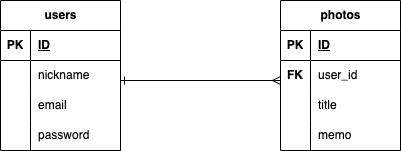
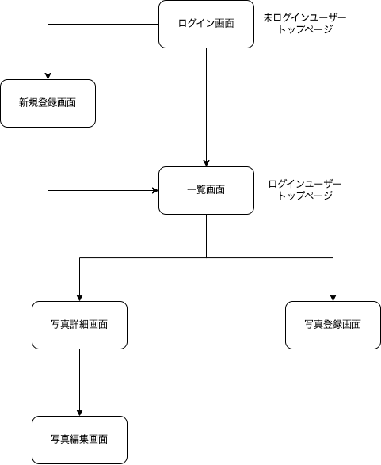

# Photo Organize  
  
  
  
## 概要  
**スクショを中心とした写真の管理に！**  
毎日のようにスクショを撮りますが、後で見返すと「これ何のために撮ったんだっけ？」と思うことが多いです。  
日常的に気になる物事をスクショで保存する人、  
自分で細かく写真の仕分けがしたい人、  
クリエイターなど情報や発想メモを視覚的に分別して残したい人,  
そういったスマホユーザーに向けた写真管理アプリです！  
  
  
  
## アプリURL  
https://photo-organize.onrender.com  
- Basic認証ID: admin  
- Basic認証パスワード: 1234  
  
  
  
## テスト用アカウント  
- メールアドレス: sample@sample  
- パスワード: sample1  
  
  

## 利用方法  
1. ログイン、または新規登録を行い一覧ページへ  
2. 一覧ページの How To を参考に写真登録ページへ進む  
3. 写真登録ページでは一度に最大10枚まで掲載  
4. 投稿した写真は一覧ページからのクリックで拡大画像での詳細確認が可能  
5. titleかmemoからの検索で、該当の一覧表示が可能 
  
  
## 開発の経緯  
日々増えるスクショを含む画像を**整理できずに諦めてしまう**経験はないでしょうか？  
特に**文章やレシピなど複数枚にわたるスクショ**の管理はiPhoneの写真アプリでは見づらく感じてしまいます。  
後回しにしがちな作業を負荷なく解決するため構想しました。  
  
  
  
## 主要機能  
**一覧ページ(PC)**  

  
**詳細ページ(PC)**  
  
  
**一覧ページ未登録時(スマートフォン)**  

**検索機能(スマートフォン)**  

  
  
## データベース設計  

  
  
  
## 画面遷移図  
 
  
  
## 開発環境  
- **フロントエンド**: HTML / CSS / JavaScript / Tailwind CSS 3.3（tailwindcss-rails tailwindcss-ruby 使用）  
- **サーバーサイド**: Ruby 3.2 / Ruby on Rails 7.1  
- **認証機能**: Devise  
- **画像投稿**: Active Storage  
- **検索機能**: Ransack
- **データベース**: MySQL（開発） / PostgreSQL（本番）  
- **デプロイ環境**: Render  
- **テスト**: RSpec  
- **バージョン管理**: GitHub  
  
  
  
## 制作時間  
企画立案から実装まで約2週間  
  
  
  
## 工夫したポイント  
- 写真はビジュアル要素が強くそれ自体に色や情報量が多いため、視認性・操作性を損なわないよう背景色を白・文字色やボタン類も白黒で統一。UIのノイズを排除し写真を主役に。  
- アクションの重要度に応じてボタンサイズにコントラストをつけ、特に「削除」や「ログアウト」などの重要操作はホバー時に強調されるようUIを調整。  
- 投稿時に任意の情報を残せるよう、memo欄（最大250文字）を設置。自由記述でユーザーの情報整理を補助。さらにフリーワード検索でtitle・memoから自在に検索表示ができる。  
- 画像一覧にはTailwind CSSのレスポンシブグリッド（grid-cols）を利用し、スマートフォンでも2列表示を実現。画面サイズに応じて列数を自動調整し、どのデバイスでも快適に閲覧可能。  
- 個人専用の写真管理ツールとして設計、未ログインユーザーのルート制御でセキュリティ面を考慮。  
  
  
## 実装予定の機能   
- カテゴリー機能: ユーザーがオリジナルのカテゴリーを登録可能  
- カテゴリー分類機能: カテゴリーごとにそれぞれのページを表示  

